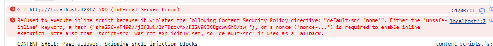

# Angular Universal With Runtime Configuration

This project was generated with [Angular CLI](https://github.com/angular/angular-cli) version 13.1.4, then updated to Angular 16.

## NB: This project contains boilerplate code, but contains errors
The purpose is to use runtime configuration in lieu of 'environment.ts'.  Whilst this works in normal client-side mode, it fails in SSR (server-side rendering).

### Server-side error

Run `npm run dev:ssr` and navigate to http://localhost:4200.
Error in browser window:
```
TypeError: Failed to parse URL from ../../assets/config.json
    at Object.fetch (node:internal/deps/undici/undici:11457:11)
```




Alternatively, run `npm run prerender`.

```
ERROR Error: Uncaught (in promise): TypeError: Failed to parse URL from ../../assets/config.json
TypeError: Failed to parse URL from ../../assets/config.json
    at new Request (node:internal/deps/undici/undici:7043:19)
    at fetch2 (node:internal/deps/undici/undici:10598:25)
    at Object.fetch (node:internal/deps/undici/undici:11455:18)
    at fetch (node:internal/process/pre_execution:230:25)
    at D:\Prototypes\uni-with-config\node_modules\zone.js\bundles\zone.umd.js:1574:40
    at proto.<computed> (D:\Prototypes\uni-with-config\node_modules\zone.js\bundles\zone.umd.js:1017:28)
    at AppConfigService2.loadAppConfig (D:\Prototypes\uni-with-config\dist\uni-with-config\server\main.js:1:2330695)
    at D:\Prototypes\uni-with-config\dist\uni-with-config\server\main.js:1:2333672
    at ApplicationInitStatus2.runInitializers (D:\Prototypes\uni-with-config\dist\uni-with-config\server\main.js:1:943384)
    at D:\Prototypes\uni-with-config\dist\uni-with-config\server\main.js:1:954168
    at resolvePromise (D:\Prototypes\uni-with-config\node_modules\zone.js\bundles\zone.umd.js:1250:35)
    at D:\Prototypes\uni-with-config\node_modules\zone.js\bundles\zone.umd.js:1157:21
    at Object.reject (D:\Prototypes\uni-with-config\node_modules\zone.js\bundles\zone.umd.js:1173:37)
    at fetch2 (node:internal/deps/undici/undici:10600:11)
    at Object.fetch (node:internal/deps/undici/undici:11455:18)
    at fetch (node:internal/process/pre_execution:230:25)
    at D:\Prototypes\uni-with-config\node_modules\zone.js\bundles\zone.umd.js:1574:40
    at proto.<computed> (D:\Prototypes\uni-with-config\node_modules\zone.js\bundles\zone.umd.js:1017:28)
    at AppConfigService2.loadAppConfig (D:\Prototypes\uni-with-config\dist\uni-with-config\server\main.js:1:2330695)
    at D:\Prototypes\uni-with-config\dist\uni-with-config\server\main.js:1:2333672 {
  rejection: TypeError: Failed to parse URL from ../../assets/config.json
      at new Request (node:internal/deps/undici/undici:7043:19)
      at fetch2 (node:internal/deps/undici/undici:10598:25)
      ... 5 lines matching cause stack trace ...
      at D:\Prototypes\uni-with-config\dist\uni-with-config\server\main.js:1:2333672
      at ApplicationInitStatus2.runInitializers (D:\Prototypes\uni-with-config\dist\uni-with-config\server\main.js:1:943384)
      at D:\Prototypes\uni-with-config\dist\uni-with-config\server\main.js:1:954168 {
    [cause]: TypeError [ERR_INVALID_URL]: Invalid URL
        at new NodeError (node:internal/errors:399:5)
        at new URL (node:internal/url:560:13)
        at new Request (node:internal/deps/undici/undici:7041:25)
        at fetch2 (node:internal/deps/undici/undici:10598:25)
        at Object.fetch (node:internal/deps/undici/undici:11455:18)
        at fetch (node:internal/process/pre_execution:230:25)
        at D:\Prototypes\uni-with-config\node_modules\zone.js\bundles\zone.umd.js:1574:40
        at proto.<computed> (D:\Prototypes\uni-with-config\node_modules\zone.js\bundles\zone.umd.js:1017:28)
        at AppConfigService2.loadAppConfig (D:\Prototypes\uni-with-config\dist\uni-with-config\server\main.js:1:2330695)
        at D:\Prototypes\uni-with-config\dist\uni-with-config\server\main.js:1:2333672 {
      input: '../../assets/config.json',
      code: 'ERR_INVALID_URL'
    }
  },
  promise: ZoneAwarePromise [Promise] {
    __zone_symbol__state: 0,
    __zone_symbol__value: TypeError: Failed to parse URL from ../../assets/config.json
        at new Request (node:internal/deps/undici/undici:7043:19)
        at fetch2 (node:internal/deps/undici/undici:10598:25)
        ... 5 lines matching cause stack trace ...
        at D:\Prototypes\uni-with-config\dist\uni-with-config\server\main.js:1:2333672
        at ApplicationInitStatus2.runInitializers (D:\Prototypes\uni-with-config\dist\uni-with-config\server\main.js:1:943384)
        at D:\Prototypes\uni-with-config\dist\uni-with-config\server\main.js:1:954168 {
      [cause]: [TypeError]
    }
  },
  zone: <ref *1> Zone {
    _parent: Zone {
      _parent: null,
      _name: '<root>',
      _properties: {},
      _zoneDelegate: [_ZoneDelegate]
    },
    _name: 'angular',
    _properties: { isAngularZone: true },
    _zoneDelegate: <ref *2> _ZoneDelegate {
      _taskCounts: [Object],
      zone: [Circular *1],
      _parentDelegate: [_ZoneDelegate],
      _forkZS: null,
      _forkDlgt: null,
      _forkCurrZone: null,
      _interceptZS: null,
      _interceptDlgt: null,
      _interceptCurrZone: null,
      _invokeZS: [Object],
      _invokeDlgt: [_ZoneDelegate],
      _invokeCurrZone: [Circular *1],
      _handleErrorZS: [Object],
      _handleErrorDlgt: [_ZoneDelegate],
      _handleErrorCurrZone: [Circular *1],
      _scheduleTaskZS: [Object],
      _scheduleTaskDlgt: [_ZoneDelegate],
      _scheduleTaskCurrZone: [Circular *1],
      _invokeTaskZS: [Object],
      _invokeTaskDlgt: [_ZoneDelegate],
      _invokeTaskCurrZone: [Circular *1],
      _cancelTaskZS: [Object],
      _cancelTaskDlgt: [_ZoneDelegate],
      _cancelTaskCurrZone: [Circular *1],
      _hasTaskZS: [Object],
      _hasTaskDlgt: [_ZoneDelegate],
      _hasTaskDlgtOwner: [Circular *2],
      _hasTaskCurrZone: [Circular *1]
    }
  },
  task: ZoneTask {
    _zone: Zone {
      _parent: null,
      _name: '<root>',
      _properties: {},
      _zoneDelegate: [_ZoneDelegate]
    },
    runCount: 0,
    _zoneDelegates: null,
    _state: 'notScheduled',
    type: 'microTask',
    source: 'Promise.then',
    data: ZoneAwarePromise [Promise] {
      __zone_symbol__state: null,
      __zone_symbol__value: [Array]
    },
    scheduleFn: undefined,
    cancelFn: undefined,
    callback: [Function (anonymous)],
    invoke: [Function (anonymous)]
  }
}
✖ Prerendering routes to D:\Prototypes\uni-with-config\dist\uni-with-config\browser failed.
```

## Other standard client-side operations work
### Development server

Run `ng serve` for a dev server. Navigate to `http://localhost:4200/`. The app will automatically reload if you change any of the source files.

### Code scaffolding

Run `ng generate component component-name` to generate a new component. You can also use `ng generate directive|pipe|service|class|guard|interface|enum|module`.

### Build

Run `ng build` to build the project. The build artifacts will be stored in the `dist/` directory.

### Running unit tests

Run `ng test` to execute the unit tests via [Karma](https://karma-runner.github.io).

### Running end-to-end tests

Run `ng e2e` to execute the end-to-end tests via a platform of your choice. To use this command, you need to first add a package that implements end-to-end testing capabilities.

### Further help

To get more help on the Angular CLI use `ng help` or go check out the [Angular CLI Overview and Command Reference](https://angular.io/cli) page.
